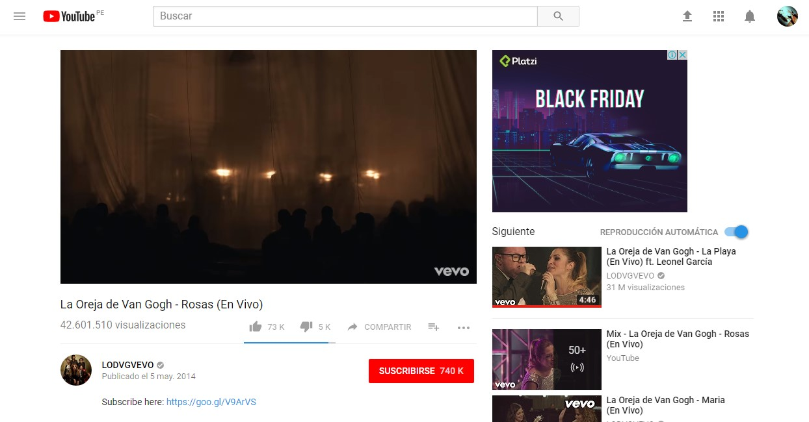

# YouTube
 ```bash
   https://www.youtube.com/   
   ```
* **¿Qué parte es UX y que parte es UI?**

***

## UX (User eXperience)

[**Que siente mientras interactúa**]

  1. Que pueda ingresar cada usuario con la cuenta de google.

  2. Que pueda configurar o personalizar mi canal.

  3. Que pueda seleccionar los archivos que quiera subir.

     * Que pueda clasificar el video subido (Público, Oculto, Privado, programado).

     * Clasificarlo por categorías.

  4. Puedo ver en tiempo real las visualizaciones del video (Anatytics).

  5. Buscar de manera práctica los videos.

  6. Puedo explorar otros canales.

  7. Puedo pertenecer a una comunidad.

  8. Sugerencia de distintos videos y tipos de música (Tendencia).

  9. Sugerencia de una colección de videos vistos por el mismo usuario.

10. Calidad de video dependiendo la velocidad del internet.

11. Poner pausa, adelantar y retroceder el video.

12. Abrirlo en cualquier dispositivo.

13. Permite suscribirse para observar la calidad de video (acercamiento y permite involucramiento con el contenido).

14. Permite consultar cualquier interrogante sobre la página e incluso ponerse en contacto.

15. Permite enviar sugerencias sobre la página (Describir problema o compartir ideas).

16. Selección por categorías (YouTube TV, YouTube  Gaming, YouTube Music, YouTube Kids, Academia de Creadores, YouTube para artistas).

17. Poder cambiar el idioma del video.

18. Pueda ampliar el video.

19. Pueda manipular el volumen.

20. Conocer el tiempo total del video.

21. Pueda recibir notificaciones con respecto a los videos del historial.

22. Que pueda omitir publicidades.

***

## UI (User Interface) 

[**Con lo que interactúa**]  

1. Diseño del Menú.

2. Los colores del logo (Rojo y Negro).

3. Diseño y colores de botones (Rojo, plomo).

4. Barra del buscador.

5. Selección de íconos.

6. La forma, tamaño de los videos a ver como los videos sugeridos.

7. Barra de videos sugeridos.

8. Barra de avance del video (Rojo y plomo).

9. Los colores de fondo y del menú (Blanco y plomo).

10. Fuente y color para los comentarios y demás letras.

11. Forma y tamaño para las imágenes de los usuarios.
***
## Imágenes 


***

***

***

***

***

***

***

***

***

***


